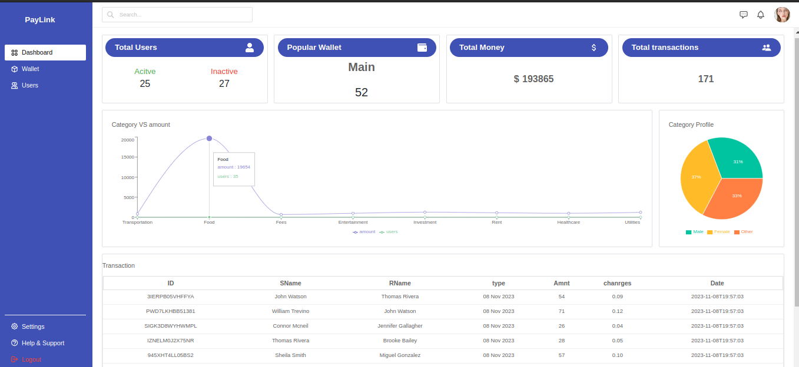
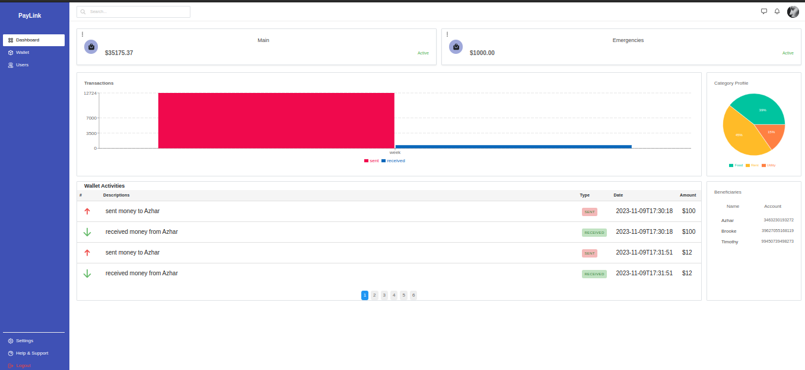

# PayLink-Front-end

This is a money transfer app that utilizes graphs and charts read real data from the back-end to provide users with a more visual and informative understanding of their financial data.




## Features

**click to expand**

<details>
<summary>Admin </summary>

> - View analytics of all user accounts
> - Can activate and deactivate user accounts
> - View Gender distribution pie chart
> - View trends in terms of graph

  </details>
<details>
<summary>User </summary>

> - The user can see the statistics of their transactions
> - Be able to send money to beneficiaries
> - Can create upto 3 wallets, (savings,investment and emergencies)
> - can move funds between wallets
> - can activate and deactivate wallets
> - View a realtime comparison of the money movement in terms of a barchart

</details>

## Testing

> **NB: Use the following accounts to test the application and send money between users:**
>
> - Admin-username: aa
> - Admin-password: aa

---

> - user1-username: zz
> - user1-password: zz
> - user2-AccountNumber: 3463230193272

---

> - user2-username: qq
> - user2-password: qq
> - user2-AccountNumber: 33064411044628

## Setup

### 1. Clone the repository

```txt
https://github.com/Bisinle/PayLink-Front-end
```

### 2. Navigate to the project's directory

```txt
cd PayLink-Front-end
```

### 3. Install required dependencies

```react
npm install --legacy-peer-deps
```

### 4. Run the app

```react
npm run dev
```

## Acknowledgements

We would like to express our gratitude to the open-source community and all the developers whose libraries and tools have made this project possible.

Thank you for using this school management system! We hope it helps you on your management journey. 🚀

## Authors & License

Authored by:

[Bisinle Daud](https://github.com/Bisinle)

[Cathy Maseki](https://github.com/cherise43)

[Joseph Karanja](https://github.com/Joeyy-K)

[Gordon Kengere](https://github.com/Slonetech)

[Tony Brian ](https://github.com/tonybria)

Licensed under the [MIT License](LICENSE) - see the [LICENSE](LICENSE) file for details.
